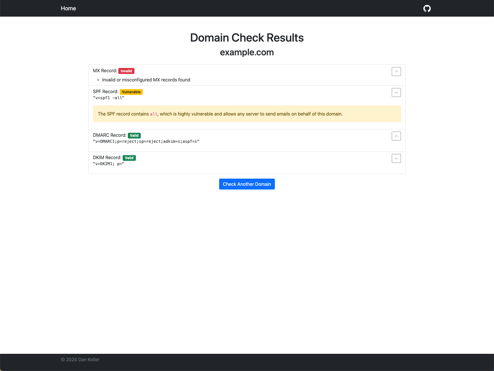

# Spoofy

[](https://www.python.org/downloads/release/python-3100/)
[](LICENSE)
[](https://github.com/dikayx/spoofy/actions/workflows/python-app.yml)

Spoofy is a small web app that allows you to test a domain's MX, SPF, DKIM, and DMARC records. Based on the results, you can see if your domain is properly configured or potentially vulnerable to spoofing.



## Features

-   📧 Check MX, SPF, DKIM, and DMARC records
-   🔒 Check the SSL status of the domain
-   🔍 View detailed information about each record
-   📋 Get an overview of the records' status
-   🛡️ Get recommendations for each record

## Get started

Download the latest release from the [releases page](https://github.com/dikayx/spoofy/releases) and use the [setup.sh](setup.sh) (Mac & Linux) or [setup.bat](setup.bat) (Windows) script to set up the app via Docker or locally. For more detailed instructions, see the [installation guide](docs/INSTALLATION.md).

If you are already familiar with Git, you can use the commands below to clone the repository and run the setup script.

### Quickstart

To get the app up and running on Mac or Linux, run:

```bash
git clone https://github.com/dikayx/spoofy.git && cd spoofy && chmod +x setup.sh && ./setup.sh
```

On Windows, open a command prompt (cmd) and run:

```cmd
git clone https://github.com/dikayx/spoofy.git && cd spoofy && setup.bat
```

Follow the instructions in the terminal to start the app. By default, it will be available at [http://localhost:8080](http://localhost:8080). If you want to use SSL, see the [Securing the app with SSL](docs/INSTALLATION.md#securing-the-app-with-ssl) section in the installation guide.

### Usage

It's simple! Just enter a domain name in the input field and click the "Check" button. The app will then display the SPF, DKIM, and DMARC records for the domain. If you want to check another domain, click the "Reset" button.

## License

This project is licensed under the MIT License - see the [LICENSE](LICENSE) file for details.
